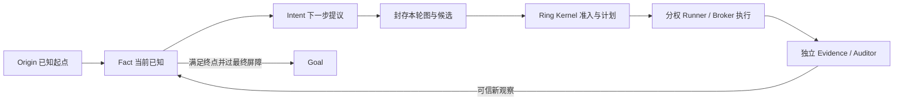

# Origin → Fact/Intent → Goal：融合后的产品边界

日期：2026-10-05（Asia/Shanghai）。这是用户对融合方向的修正。当前代码只实现
部分接线，以下“应当”是待实现的产品约束，不是运行事实。

## 结论

Cairn 项目创建时就有两个端点：`origin` 是已知起点，`goal` 是要达到的终点。
逐步生长的是两者之间的 Fact/Intent 因果路径。Ringharness 加入后，这张图
仍是用户理解问题、提出方向、观察新事实的主界面。Ring 的 GoalContract
承载同一个终点的执行与验收约束，但不预先规定整条探索路径。

## 每轮权限

| 对象 | 产生与作用 | 不具备的权限 |
|---|---|---|
| Cairn Origin/Goal | 创建项目时固定起点和终点；后续图围绕两端生长 | 不代表 Ring Goal 已启动或已 DONE |
| Fact | 用户提供或从 Ring 证据投影；需标注来源与信任状态 | 描述文字不能冒充独立验收证据 |
| Intent | 人或零工具 Reason 根据当前图提出下一步方向 | 不能直接变成 Task、领取租约或调用外部工具 |
| PlanInput | 封存一个 Intent、所选 Fact/Hint 与候选摘要及版本 | `STAGED/BOUND` 不代表计划发布或 Goal 完成 |
| Ring Goal/Task | Kernel 按合同、预算、路径与能力控制长程执行 | Workflow/模型/候选不得自行写 DONE |
| Evidence/Auditor | 回传有来源的结果，驱动下一轮 Fact 与最终屏障 | 单条成功回执不能证明整个终点达成 |

## OODA 循环如何保留

| Cairn 阶段 | 融合后的实际动作 | 唯一权威 |
|---|---|---|
| Observe | 读当前图、Ring 状态和有来源的新 Fact；缺失或断线显示 UNKNOWN | 图由 Cairn 保存；执行事实由 Ring 回读 |
| Orient | 零工具 Reason 根据 Origin、Goal、Fact、Hint 解释当前差距 | Reason 仅提出解释，不产生可信 Fact |
| Decide | 选一个 Intent，封存图版本和该 Intent 的执行约束 | Cairn 记录方向；Kernel 校验合同与准入 |
| Act | Ring Manager 把所选方向细化为可执行 Task，Executor 经 Broker 执行，Auditor 核验 | Kernel/Runner/Broker/Auditor 分权 |
| 回环 | 已验证的结果作为新 Fact 加入图，再次 Observe/Orient | 不能用模型总结替代证据 |

当前实现把 bound project 排除于 Cairn dispatcher，且 B2 要求人工输入完整
`PlanCreate`。因此它暂停了自动 OODA，只是一条安全的过渡接线。恢复自动
循环时，不能把原 Cairn CLI 探索权限重新打开；应由零工具 Reason 产出
Intent，并由 Ring 的租约与 Effect Gateway 承接 Act。

Ring Manager 对所选 Intent 只能做受控细化。当前 R1b 只校验 Goal 合同；
它没有确定性的“输出计划仍执行所选 Intent”约束。后续须给本轮 Intent
定义结构化执行锚点与预期证据，Kernel 检查计划覆盖该锚点、来源 ID/digest、
预算、路径和能力；无法证明关联时保持待审或阻断。自然语言相似度不能当作
独立验收。允许模型细化计划，不允许它静默改选另一探索方向。

## 对当前实现的影响

现有 Ring 产品入口先绑定**已经存在**的 Ring Goal，绑定时还拒绝任何未结论
Intent；绑定后关闭 Cairn 原 dispatcher，而 B2 让人手工提交完整
`PlanCreate`。这能验证一条受控接线，但不是最终默认体验。若停在这里，
Cairn 会失去“读图 → 提 Intent → 探索 → 加 Fact → 再读图”的主循环。

下一批须补“图优先”路径：用户仍从 Origin 和 Goal 创建项目；受控创建或
选择 Ring Goal 时，只冻结终点合同、预算和验证配置，不冻结未知探索路径。
本轮 Reason 在零工具权限下从当前图提出 Intent。选中的 Intent 经 PlanInput
进入 Ring；Kernel 发布本轮合法计划与 Task，Broker 执行外部效果，Auditor
核对。受权投影只把有来源的观察追加为 Fact，随后 Reason 再读新图。
单轮计划结束后若终点尚未验收，继续下一轮；只有 Ring Kernel 的最终屏障
与 ReleaseManifest 能使页面显示 Goal 已验收。

## 验收红线

最终 E2E 固定至少两轮：`Origin + Goal → Intent 1 → Ring Effect/Evidence →
Fact 1 → Intent 2 → Ring Effect/Evidence → Fact 2 → Goal DONE`。两轮之间
必须证明第二个 Intent 使用了新增 Fact；第一轮成功时 Goal 仍未 DONE。
断线/重启后不重复外部副作用；未经验证的 Fact 不升级为 Evidence；
没有 Kernel DONE 与匹配 ReleaseManifest 时页面不得显示完成。

当前尚未实现自动零工具 Reason、自动 Goal 草稿/合同映射、受权 Fact 回流和
两轮最终 E2E。这些缺口必须先补代码，再执行最终 E2E。

## 2026-10-05 融合去留闸门

**当前裁定：不把此分支作为“增强版 Cairn”合入或发布。** 源码导入与
PlanInput 接线是开发候选。当前绑定项目没有自动 OODA；人工完整 PlanCreate
增加了操作步骤。因此现状相对原 Cairn 是体验退化，尚无证据证明长程任务
能力带来的收益超过新增控制面、部署和故障恢复成本。

另一个结构性缺口在 Ring 的现有 `PLAN_INPUT_REQUIRED` 路径：Kernel 登记
PlanInput 前要求 Ring 已有完整的 CANDIDATE PlanCreate，随后 PLAN attempt
才消费该输入。若默认路径要让 Manager 从 Cairn Intent **生成**本轮计划，
这个先后顺序必须调整为“封存 Intent → Manager 提议计划 → Kernel 校验并
采纳”。不能让用户先写完整计划，再声称 Manager 保留了 Cairn 的探索能力。

Ring 的增量价值必须来自长程执行：有界预算与权限、重启后继续、外部效果
幂等、独立证据和最终验收。Cairn 已经负责图上探索与多轮提议；Ring 不应
再复制一套黑板、Reason 或探索调度。两个调度范围须明确：Cairn 决定何时
基于新图提出和选择 Intent；Ring Temporal/Kernel 决定已选 Intent 的执行、
恢复和业务状态。Cairn 不直接派发该 Intent 的 CLI 探索或外部效果。

最小可接受的自动闭环是：

1. Cairn 的零工具 Reason 读完整图，提出或选择一个 Intent，记录来源
   Fact ID、图版本、Intent ID 与不可变 digest。用户只给 Origin、Goal 和
   必要权限边界，不必手写完整 Task DAG。
2. Ring Manager 根据该 Intent 生成本轮计划。Kernel 在准入时检查结构化
   Intent 锚点、来源、任务覆盖、预算、能力和验收条件。模型可以细化步骤；
   它若改选方向，必须重新提出 Intent 或进入显式审查，不能静默执行。
3. Ring Executor/Broker 执行，Auditor 对证据作独立判断。Ring 的受权事件
   以稳定 ID 幂等投影成 Cairn Fact，并保留来源、验证状态与关联 Intent。
   UNKNOWN 或未验证观察不能成为“已确认 Fact”。
4. Cairn 在新 Fact 入图后重新 Observe/Orient/Decide。Ring 在未通过最终
   验收屏障前不能让 Cairn 页面显示 Goal 完成。跨进程断线时两边均展示
   待对账状态，不猜测成功，也不重放未知的外部效果。

开发闸门按顺序检查：

| 闸门 | 必须看到的行为 | 失败时的决定 |
|---|---|---|
| G0 意图保真 | 原 Intent ID/digest 与来源 Fact 进入 Kernel 准入；Manager 不能静默换方向 | 停止自动执行 |
| G1 图回环 | 连续两轮；第二轮 Intent 明确引用第一轮新增 Fact；中间无需人工编完整计划 | 不称为 OODA 融合 |
| G2 权威与恢复 | Ring 独占执行状态与 DONE；重启和未知回执后外部效果不重复；证据来源可核对 | 不发布融合运行时 |
| G3 增益比较 | 同一固定任务、模型、资源和预算下，对照原 Cairn；记录目标达成、人工介入、重复效果、耗时及成本 | 无可测增益则保留独立 Ring 能力，不继续融合 |

G0–G2 完成开发后，才运行包含浏览器、控制面、执行、重启、证据回流与
最终屏障的端到端验收，并保存固定输入、环境、命令、原始输出和 SHA-256。
G3 的对照不能用单条成功演示代替；若原 Cairn 已解决同一任务且融合只增加
部署和人工操作，默认不合入。各闸门目前均未通过最终 E2E。
