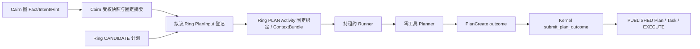

# Cairn 图进入 Ring PLAN 的受控消费缝

日期：2026-10-04（Asia/Shanghai）。状态：**接口方案，未实施、未联调、未验收**。本次只读核对 Cairn HEAD `c20c6a1867e576ea550cf421bdbaed91ccfef29a`、Ringharness HEAD `f61df68049c75ec5bd6bd279f51b196e89722031`。Ring 工作树有在途修改；以下“现行”指核对时的工作树代码，不代表固定提交或已部署实例。没有修改 Ring 业务码，也没有探测生产运行状态。

## 结论

**Cairn 图和 Ring `CANDIDATE` 目前均未进入 Ring 的零工具 PLAN 模型输入。** Cairn B2 把人工填写的完整 `PlanCreate` 以 operator 会话提交 `POST /api/v1/goals/{goal_id}/plans`，Ring 只保存 `CANDIDATE`，不给 `plan_revision`，也不创建 Task。现行公开 API 没有“采纳此候选并发布”的入口。真正发布由持有 PLAN Activity 租约的 Runner 提交 `POST /internal/v1/activities/{activity_id}/outcomes`，Kernel 的 `submit_plan_outcome` 校验并在一个事务中写 `PUBLISHED` Plan、Task、根 EXECUTE Activity 和 Goal `RUNNING`。

要让 Cairn 影响规划，建议增设 **Ring 控制面持有的、版本固定的 `PlanInput/v1` 数据入口**。Cairn 只选择图中的 Fact/Intent/Hint 并形成有界摘要；Ring 重新核对 Goal scope、版本和所引用候选，封存输入；ContextCompiler 把封存物绑定至该 PLAN attempt；Runner 只在租约内读取、核对摘要并作为**带来源标记的数据**交给零工具 Planner。Planner 仍须产出新的完整 `PlanCreate`；不能把 `CANDIDATE`、Hint、AB08 user-message 或 Cairn 的 `completed` 状态直接当成 Task/Plan 发布命令。下述路由和字段均为**拟议接口**，不得当作现有能力调用。

## 当前路径与缺口

| 位置 | 已观察行为 | 接线含义 |
|---|---|---|
| Cairn `integration/intent_bridge.py:25-43`、`routers/intents.py:93-110,143-256` | `graph_digest` 按 Fact、Intent、来源边和 Hint 排序计算；`plan-context` 给 Goal/图版本；operator 选未领取 Intent，桥接验证后把 `CairnSource/v1` 写入 `reason`。 | 图摘要和来源只是 Cairn 记录；未形成 Ring PLAN 的固定模型输入。`CairnSource/v1` 不是 Ring 认可的独立来源字段。 |
| Cairn `integration/ring_client.py:160-187`、`routers/intents.py:258-325` | POST 完整计划需 `Idempotency-Key`；Cairn 持久保存请求正文、原 operator 和键。未知回包用同一身份/同键/同正文 reconcile。 | 可保留为“候选提议”路径，但它本身不发布。 |
| Ring `routes/claims.py:485-521`、`storage/plans.py:508-636` | 公开 POST 需 operator；`submit_candidate` 校验合同并插入 `CANDIDATE`，`plan_revision=NULL`，记录 `PLAN_CANDIDATE_CREATED`。 | 没有把该候选交给 Planner 的读取/选择/采纳动作；GET plans 只是列出。 |
| Ring `temporal/runActivation.ts:633-710`、`harness/controlHttpPorts.ts:342-385`、`harness/cordisLlmBridge.ts:350-476` | Temporal 已 admit 租约；Runner 读 Activity/Goal、编译/绑定 ContextBundle、调用 `tools: []` 的 LLM、解析模型正文、交 outcome。live 提示在 `livePlanCreate.ts:376-402` 仅列 Goal objective、首个 criterion 和 `required_file`。 | 现行提示不包含 Cairn 图、CANDIDATE 正文或其摘要；仅有 ContextBundle digest 也不足以让模型看到这些数据。 |
| Ring `storage/context_compile.py:344-451`、`context_compiler/compile.py:33-89` | PLAN ContextBundle 当前固定合同、Skill、GoalReview 摘要等 artifact 引用；token 粗估超限拒绝，不静默裁剪。 | 新摘要须有可读取的封存字节和 digest，并钉在 attempt 的 ContextBundle；只增加引用、不在 Planner 提示中解析字节，仍不构成消费。 |
| Ring `routes/claims.py:216-247`、`storage/probe.py:1091-1115`、`storage/plans.py:203-468` | 内部 outcome 按联合类型分派；PLAN 校验 worker、attempt、fencing epoch、租约到期、Activity/Goal 版本、Goal `PLANNING` 及静态计划约束。成功事务写 Plan/Task/活动/事件。 | 发布权必须继续留在 Kernel；模型和 Cairn 都不能写 `PUBLISHED`、Task 或 Goal `RUNNING`。 |
| Ring `harness/cordisLlmBridge.ts:437-471`、`harness/drainPendingUserMessages.ts:20-70` | AB08 在 LLM 结束、提交 Plan outcome **之前**领取消息并 seal Turn；`attached/deferred` 是消息处置证据。 | 这次 PLAN 的模型调用已经结束。AB08 消息不可能作为本次 Planner 的前置图输入，也不改变 `PlanCreate` 或 Goal DONE。 |

### 现成的 Goal 合同改写捷径

`PUT /api/v1/goals/{goal_id}/contract` 可由 operator 带幂等键、`expected_state_revision` 在 `DRAFT/PAUSED` 修改**整个** Goal 合同；Ring `storage/goals.py:317-410` 会增加合同版本、清空计划版本并拒绝旧候选。Runner 的现行 live 提示会读新 objective、首个 criterion 描述和 `required_file:` 约束。因此，把选定 Intent 的短文字写进 objective，理论上可让模型看到该文字；这是由源码推出的**可达性推断**，未做模型调用验证。

**不采用此路作为正式集成缝。** 它把图提议变成业务目标/验收合同变更；普通 constraints 未进入 live 提示，`CANDIDATE` 的 ID/内容也未被读出；没有独立的图来源、快照摘要和 attempt 绑定。`DRAFT` 时公开候选接口还不接受候选。不能把此路描述为“Planner 已消费 Cairn 图与候选”。

另一个选择是新增 Ring “采纳候选”公开路由。若该路由直接把 `CANDIDATE` 改成 `PUBLISHED` 并创建 Task，就绕开现有 PLAN 租约和零工具 Planner，故否决。若该路由只让 operator **选择待消费的候选 ID**，并由 Ring 在 PLAN attempt 中重取、核对、交 Planner，再经 `submit_plan_outcome` 发布，它实质上是下述 `PlanInput/v1` 选择入口；可以共用一个请求，不需要第二条发布链。

## 拟议接口与固定数据

以下契约供 Ring 路径所有者认领后实现。继续使用已有的 public `POST /plans` 保存候选，不增加“按 candidate_id 直接发布”的公开入口。首个 PLAN 必须先在 Goal 上开启拟议的 `plan_input_mode=REQUIRED`，让 Kernel 的 PLAN claim 在缺少已封存输入时保持不可 admit；否则 Goal `start` 创建的 READY PLAN 可能先被 Temporal 领走，产生无图计划。Goal 可先进入 `PLANNING`，operator 再存 `CANDIDATE` 和 PlanInput；两者就绪后 Kernel 才准入该 PLAN。模式选择及切换须有独立的 Goal 版本/权限门，不能由 Cairn 单方声明。`DRAFT` 的无候选预登记可以支持，但不是首场景的必要路径。

| 拟议接口或内部边界 | 请求/响应与限制 |
|---|---|
| Cairn `POST /projects/{id}/plan-snapshots` | owner + 当前 Ring operator/project scope；提交 `selected_intent_id`、明确的 `fact_ids`/`hint_ids`、`graph_digest`、Goal `contract_revision`/`contract_digest`、`expected_plan_revision`、可选 `candidate_plan_id`。服务器重新读同一 SQLite 事务中的图，检查来源边和绑定，生成不可变 `PlanInput/v1` 的 Cairn 部分；同一选择同一版本返回相同 digest。此接口未存在。 |
| Cairn `GET /projects/{id}/plan-snapshots/{digest}` | 仅授权主体可读已封存的规范 JSON 和摘要；供审查和故障恢复。**Cairn 的图 digest 证明其本地字节一致，不证明 Fact 为可信 Evidence。** 此接口未存在。 |
| Ring `POST /api/v1/goals/{goal_id}/plan-inputs` | operator + 项目 scope + `Idempotency-Key`。提交下述规范快照、Cairn binding ID、`candidate_plan_id`；Ring 在事务中检查 Goal/合同/计划版本、信任状态、candidate 属同一 Goal 且仍为 `CANDIDATE`，读它的 `content_digest` 和规范计划字段；重算摘要、检查大小/路径/预算提示、封存 Ring `plan_input_id`、`content_digest`、状态 `STAGED`。返回 ID/digest，不返回 Task。此接口未存在。 |
| Ring `GET /api/v1/goals/{goal_id}/plan-inputs/{id}` | 受 scope 保护，显示来源、版本、digest、`STAGED/BOUND/STALE` 和绑定的 PLAN Activity/attempt；丢回包后按原键或 ID 查询。此接口未存在。 |
| Ring PLAN admit/ContextCompiler | `plan_input_mode=REQUIRED` 时，claim 在无有效 PlanInput 下不准入；在 PLAN claim 前对 `READY` Activity 原子钉住**一个** `plan_input_id` 与 digest；若已存在 ACTIVE attempt，拒绝替换。ContextCompiler 以 `CANDIDATE` 分类把封存摘要 artifact 加到 `input_bindings`，并把精确输入 ID/digest 绑定该 attempt。若不能在 claim/compile 与版本检查之间实现原子钉扎，此批不得启用。 |
| Ring Runner PLAN 端口 | 在 `compileContext`/`bindContext` 后，通过 worker 受限端口取该 attempt 的封存字节；逐字节校验 digest、Goal ID、合同/计划版本、ContextBundle 引用。把数据放进零工具提示的独立、带引号的“未验证提议”区，保留完整 Goal 合同作为上位约束；明确要求完整 `PlanCreate`。`REQUIRED` 模式不得静默走现行“三语义槽位→首个 criterion、默认 `src/**` 单 Task”的捷径。模型未实际收到摘要字节即失败。 |
| Ring Kernel PLAN outcome | 在现有 `submit_plan_outcome` 事务内，`REQUIRED` 模式还须核对该 attempt 所绑定 `plan_input_id`/digest、候选和合同版本，并把来源关系与 `PUBLISHED` Plan 同事务记录。若绑定缺失或过期，拒绝 outcome；Runner 的自报输入 ID 不作权威。此校验未存在。 |

`PlanInput/v1` 的最小规范 JSON 字段：`schema`、`cairn_project_id`、`ring_project_id`、`ring_goal_id`、`graph_digest`、`selected_intent_id`、排序去重的 `source_fact_ids`、`hint_ids`、每条所选文字的 `id/text/source_kind`、`candidate_plan_id|null`、Ring 重取的 `candidate_content_digest|null`、候选的受限结构摘要、`goal_contract_revision`、`goal_contract_digest`、`expected_plan_revision`、`created_by`。使用确定性 JSON 编码和 SHA-256；保留原始规范字节。固定允许的条目数、每条字数、总字节数和输入 token 上限；超限拒绝，不裁掉关键合同或悄悄选择另一 Intent。摘要只包含图的最少文本，不含 cookie、key、原始敏感 Evidence 或工具指令。

Ring 应把图文字与候选内容一律标成**未经验证的提议**。候选结构由 Ring 数据库按 ID/digest 重取，不相信 Cairn 复制的候选正文。需要事实支撑时，只引用 Ring 权限过滤且可追溯的 Evidence；Fact 描述或模型总结不能升格为 Evidence。Planner 的输出即使逐字复制候选，也必须再次经过 `PlanCreate` 结构、coverage、预算、路径、capability 与租约/版本闸门。已发布 Plan 应有 Kernel 写入的专用来源关系，记录 `plan_input_id`/digest、候选 ID/digest、模型调用 ID；不能只相信模型写的 `reason`。缺少可审计关系时不得宣称“由该图驱动”。

## 角色、失败关闭、幂等与恢复

| 关口 | 失败关闭和恢复要求 |
|---|---|
| Cairn 选择 | owner/当前 Ring operator 双重授权，项目绑定和 Goal scope 一致；已领取、已结束或无来源 Fact 的 Intent 拒绝。图 digest、合同版本、plan revision 任一漂移，返回冲突并要求重新选择。Cairn CLI、Reason/Explore worker 与 `complete` 仍不能在绑定项目上接管执行。 |
| 输入封存 | `Idempotency-Key` 的 scope 至少含 Goal、actor、路径、键；同键不同规范 body 为冲突。同一 `(goal_id, graph_digest, selected_intent_id, candidate_plan_id, contract_revision, expected_plan_revision)` 可查回相同 input；Cairn 先持久化请求 body/键/原 operator，再发 Ring。不能用新键猜测超时结果。 |
| PLAN claim/编译 | 只让登记的 manager worker 持租约。`REQUIRED` 模式下无 input 时保持 READY 且不可 admit；input `STALE`、候选已被拒/Goal 合同变化、对象仓不可用、摘要不符或预算不足时，停止模型调用并记录明确原因，不退回 fixture 或无图提示。新 attempt 应重核版本并显式重绑定，同一 attempt 不接受不同 ContextBundle digest。 |
| 模型与发布 | `tools: []`；禁止提示中的“请调用工具”获得权限。模型无正文、解析失败、修复轮仍失败，不提交 outcome。Runner 只提交 `lease + expected_state_revision + {plan: PlanCreate}`；Kernel 拒绝失租、旧 epoch、旧 revision、无覆盖、越权路径和无效配置。`CANDIDATE` 不因输入已封存自动变 `PUBLISHED`。 |
| 回包丢失/重启 | 候选创建未知用 Cairn 已有原 operator/原键/原正文 reconcile；PlanInput 未知用原键查登记结果；PLAN outcome 未知先读 Activity、Goal、plans、tasks 和事件，核对 `plan_input_id`/digest 与 plan revision。若已发布，投影一次；若状态不能证明，保留 `UNKNOWN`，不重发另一份 PlanCreate 或触发第二次外部效果。租约过期由 Kernel/Temporal 正常恢复，新 owner_epoch 与 attempt 必须重新校验输入。 |
| AB08 | user-message 队列保持独立。现行 drain 在本轮 LLM 后；`attached/deferred` 仅表示门禁处置，不回写本轮规划输入。若产品要“规划前用户指令”，需另建带版本/来源/摘要的 PlanInput 通道，并重新开一轮 PLAN；不得重命名 AB08 消息以绕过输入闸门。 |

## `owned_paths` 与释放

本文件只修改 Cairn `docs/integration/plan-consumption-seam.md`。以下是**后续认领建议，不是本次已获写权限**；每批登记 owner、batch、`owned_paths`、`depends_on`、verification_owner、reviewed_by、status、PR、merged_by，并在动工前核对共享工作树/Issue 的现行占用。

| 批次 | 建议 `owned_paths`、依赖与释放条件 |
|---|---|
| C1 Cairn 封存 | Cairn owner：`cairn/src/cairn/server/integration/{intent_bridge.py,ring_client.py,plan_snapshot.py}`、`cairn/src/cairn/server/routers/intents.py`、必要 SQLite migration/UI；依赖 B1/B2 身份和候选桥。只写 Cairn；先与并行 Cairn owner 确认路径释放。 |
| R1 Ring 输入登记/编译 | **Cursor 路径**：`apps/control/src/control_api/routes/**`、`packages/control_kernel/src/control_kernel/{protocols,storage}/**`、`packages/context_compiler/**`、迁移及生成契约；Cursor 需在 Ring 批次/Issue 明确认领，若这些路径已在途先等原 owner 释放。Codex 只做独立审查。不得手改 `packages/api-client/src/generated.ts`。 |
| R2 Runner PLAN 消费 | **Cursor 路径**：`apps/runner/src/harness/{controlHttpPorts.ts,cordisLlmBridge.ts,livePlanCreate.ts}`、`apps/runner/src/temporal/runActivation.ts`；依赖 R1 的 artifact/ContextBundle 契约及与当前 Runner 在途修改的明确释放。实现必须记录模型输入摘要和模型调用 ID。 |
| R3 编排调整（仅若 R1/R2 无法在现有 admit 前封存） | **Hermes 路径**：`packages/orchestration/**`、`tests/temporal/**`，由 Hermes 认领并与 Cursor 协商跨界；不把 Temporal Workflow COMPLETED 当成 Goal DONE。Cursor 如需触碰这些路径，先获 Hermes 明确释放。Ring 业务码本次均未触碰。 |

## 端到端验收缝

开发中只做静态/契约核对和必要的隔离窄缝；**不新增或运行单元测试，不在开发期间运行全量 E2E**。实现收敛、路径释放和固定候选后，最后运行以下隔离 E2E，并产出可重复工件。一次绿色结果只证明该层，不继承 Ring 既往测试或部署状态。

1. 固定 Cairn/Ring 提交、脏树补丁或清洁工作树、隔离仓库提交、Goal/Policy/Skill/VerificationProfile、模型版本、预算、时区、seed。预置 `plan_input_mode=REQUIRED`，启动 Goal 后先证明 PLAN 在无输入时不可 admit。创建至少两个 Intent，选择一个；记录图规范字节/digest、Cairn snapshot ID、Ring candidate ID/digest 和 PlanInput ID/digest。
2. 在浏览器和 API 提交候选，核对 Ring PG/API 仅有 `CANDIDATE`、`plan_revision=NULL`、Task 数为零。封存 PlanInput 后，检查 PLAN Activity attempt、ContextBundle 的 `CANDIDATE` artifact 引用及摘要，捕获**送给模型的脱敏输入**确实含被选 Intent 和候选摘要。检查 `tools=[]`、ModelInvocation ID、模型输出与 `PlanCreate` 的关联。
3. 由持租约 Runner 提交 outcome。用 Ring API/PG/Temporal history 证实同一 Goal 新增恰好一个 `PUBLISHED` Plan revision、预期 Task 和根 EXECUTE Activity；核对 `PLAN_PUBLISHED` 事件、来源 ID/digest、租约 epoch。Cairn UI 只显示 Ring 回读状态，不把 candidate 或消息处置显示为 DONE。
4. 固定负例：图/合同/候选版本漂移、跨项目/无 operator、摘要篡改、超 token、对象仓不可用、输入缺失、失租、重复/乱序请求、模型空输出、AB08 在 LLM 后抵达。逐项证明无 Plan 发布/Task 创建或有明确拒绝；AB08 内容不出现在**此前**模型输入。
5. 在候选 POST、PlanInput 登记、ContextBundle 编译、模型结束、outcome 提交各断点注入回包丢失或进程重启。按原键、原 attempt/新 attempt 和 Ring 权威状态恢复；证明无第二次发布、无假 DONE。若任何权威状态未知，记录 `UNKNOWN` 而非自行重试外部动作。

工件目录由验收批次认领，至少含 `manifest.json`（提交与版本、固定输入摘要、运行时间/时区、命令、环境摘要）、脱敏请求/响应和 request ID、Ring Goal/Activity/attempt/Plan/Task/ModelInvocation ID、ContextBundle/artifact digest、PG 查询、Temporal history、Cairn 图快照、浏览器截图、失败注入时间线、每层 `passed/failed/skipped/not-run` 矩阵及工件 SHA-256。浏览器只证明显示；Plan/Task 以 Kernel/PG 为准；外部副作用与 Goal DONE 需另按 Ring Evidence/审计/最终屏障核对。

## 源码定位

- Cairn：`cairn/src/cairn/server/integration/{README.md,intent_bridge.py,ring_client.py,bindings.py}`；`cairn/src/cairn/server/{db.py,models.py,routers/intents.py}`；`docs/integration/ringharness-development-plan.md`。
- Ring：`apps/control/src/control_api/routes/{claims.py,probe.py,goals.py}`；`packages/control_kernel/src/control_kernel/{protocols/plans.py,protocols/goals.py,storage/plans.py,storage/probe.py,storage/context_compile.py,storage/goals.py}`；`packages/context_compiler/src/context_compiler/{snapshot.py,compile.py}`；`apps/runner/src/{temporal/runActivation.ts,harness/controlHttpPorts.ts,harness/cordisLlmBridge.ts,harness/livePlanCreate.ts,harness/drainPendingUserMessages.ts}`；Ring `AGENTS.md` §7.1 路径归属。
