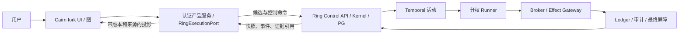

# Cairn fork × Ringharness：隔离软件仓库纵向开发计划

日期：2026-10-04（Asia/Shanghai）。状态：**分阶段实施中，未联调、未验收**。最初只读核对的 Cairn HEAD 为 `8e7e0ea67552383851dfcabfba0c4e9c8d007878`，Ringharness HEAD 为 `f61df68049c75ec5bd6bd279f51b196e89722031`；Ringharness 工作树有在途改动，因此下述“已存在”只指当时看到的源码，不代表已部署实例可用。Cairn 与 Ringharness 的生产身份、目标、运行数据均未探测。

执行更新（2026-10-04 23:30，Asia/Shanghai）：方案编写后的 Cairn fork 分支 `ringharness-integration` 已提交 B1 产品入口/只读绑定与 B2 人工完整 `PlanCreate` 候选桥接，当时提交为 `c20c6a1`。这些提交只做过窄范围语法、导入和静态核对，尚未完成真实浏览器、Ring Control、Temporal、Broker、审计或恢复的端到端验收。B2 的公开候选不会自动成为 `PUBLISHED` Plan；B2b/B2c 先解决零工具 PLAN 输入与发布接线。B3/B4 和最终 E2E 未启动。

执行更新（2026-10-04 23:41，Asia/Shanghai）：C1 Cairn 不可变图快照 API 已合入，参见 [PLAN 消费缝](plan-consumption-seam.md) 和 [固定融合 E2E 场景](fusion-e2e-scenario.md)。Ring 侧 R1 输入登记/准入、R2 Runner 消费、R3 Temporal 待输入唤醒已作为[待认领 Issue #81](https://github.com/Cz07cring/ringharness/issues/81) 登记；现行路径所有者尚未确认释放。C1 只有本地图快照与受权回读，尚无 Ring PlanInput 调用方；C2 页面入口在开发。B3 决策门继续关闭，最终融合 E2E 的各层仍为 `not-run`。

执行更新（2026-10-04 23:48，Asia/Shanghai）：C2 页面入口在 `335a704` 合入，展示候选和已封存本地快照，并提供按摘要回读。审查发现写入回包丢失后刷新页面会丢失原请求，C2a 开始补跨刷新 UNKNOWN 恢复；该时点尚未做真实浏览器验证。

执行更新（2026-10-04 23:56，Asia/Shanghai）：C2a 已补会话内原请求保存与刷新恢复，并移除“所选 B2 候选因 Goal DONE 而已完成”的假关联；`de01271` 使所有无权威回读的写入错误继续显示 `UNKNOWN`。C1a 在 `57db02d` 增加同事务原请求指纹映射，授权重试可在图或 Goal 漂移后读回原 digest。独立窄范围 ASGI/SQLite 诊断复跑了旧库升级、回滚、漂移/读接口故障、授权与并发；这不是浏览器或融合 E2E。关闭浏览器标签或清除 `sessionStorage` 后，UI 可能失去原请求，需通过有权限的本地记录核对。C3 向 Ring 提交 PlanInput、C4 受控启动与重新规划仍依赖 R1/R2/R3，尚未启动。B3 决策门保持关闭；全部融合 E2E 层仍为 `not-run`。

## 结论和范围

采用 **Cairn fork 作为 UI 与探索投影**：保留 `Fact → Intent → Explore → Reason` 的图、用户 Hint 和探索方向，但这些记录没有执行、验收或终态权限。**Ringharness PostgreSQL、ControlKernel、Temporal 与 ExecutionBroker/Effect Gateway 分别是持久状态、业务裁决、活动编排与外部副作用的权威**。Ring EvidenceLedger、独立 Auditor、最终屏障及 ReleaseManifest 决定可引用证据与 `DONE`。Cairn 的 SQLite 只保存图、绑定和投影游标；不得直接写 Ring PG，也不得用 SQLite `completed`、模型 `complete` 或 HTTP 202 冒充 Ring `DONE`。

**第一条纵向场景**固定为一个隔离 Git 软件仓库中的可回滚缺陷修复。冻结仓库提交、依赖锁、镜像、模型配置、预算、随机种子和 `allowed_paths`；受保护验收文件由独立验证器持有。用户在 Cairn 建图并绑定已配置的 Ring Goal；Reason 产生至少两个不同 Intent；受控桥接只选一个符合合同的 Intent 形成候选；Ring 发布 Task 并在隔离工作区修复；可信效果回执、候选清单和审计结果成为带来源的 Cairn Fact；Reason 再读图；只有 Ring Kernel 的 `DONE` 使 UI 显示“已验收完成”。若不采用 Ring 既有 `tests/fixtures/business_e2e/order_service`，先另行固定同等可复现仓库；`doc/06` 的“重连缺陷”是规格示例，当前不能当作现成 fixture。

## 证据边界与 API 核对

Ring `doc/README.md`、`doc/01-开发文档.md`、`doc/05-API接口文档.md`、`doc/06-E2E开发调试文档.md` 是设计与验收约束；其中 `doc/05` 开头仍写“所有路由尚未实现”，`doc/06` 仍称启动脚本待实现。实际接口以 `apps/control/src/control_api/app.py` 注册的 `routes/*.py` 和 `packages/control_kernel/src/control_kernel/protocols/*.py` 为准。`doc/implementation/进度与验证.md` 是各批历史记录，其测试结果和共享环境状态均不能代替本次融合验收。Cairn 的 README、`docs/specs/server-protocol.md`、`docs/specs/dispatcher-design.md` 描述现有图协议与 Dispatcher；`review-artifacts/cairn-first-product-architecture-2026-10-04.md` 提供选择全系统融合时的条件方案，其同日复评明确整套融合应先证明收益。本计划把 fork 限定为产品投影，不创建第二套生产调度。

| 实际接口（本次源码） | 可用于本计划的语义 | 不可据此推断 |
|---|---|---|
| `GET /api/v1/auth/session`；`GET /api/v1/projects`、`GET /api/v1/goals?project_id=…`、`GET /api/v1/goals/{id}` | Ring 主体、项目 scope 与 Goal 绑定核对；浏览器会话或受限 Bearer 由服务端管理 | Cairn 当前路由有等价登录/授权 |
| `POST /api/v1/goals`；`POST /api/v1/goals/{id}/start` | 受许可的 operator 创建 DRAFT、用 `ControlRequest.expected_state_revision` 开始；异步命令返回 202 | 用户在图中输入目标后自动有合法 Goal/配置；202 代表 DONE |
| `POST /api/v1/goals/{id}/plans`；`GET …/plans`；`GET …/tasks` | operator 带 `Idempotency-Key` 交 `PlanCreate`，只保存 `CANDIDATE`；发布 `PUBLISHED` 和 Task 走另一个持有 PLAN Activity 租约的 `submit_plan_outcome` 路径 | Intent 可直接等于 Task，或当前已有公开候选采纳入口；没有通用“提交 Intent”路由 |
| `GET /api/v1/goals/{id}/snapshot`；`GET …/events?after_seq=…` | 权限过滤的运行快照、`latest_seq` 与 SSE 失效提示；按 `state_revision` 合并 | SSE 文本就是最终状态，或事件重放会重执行工具 |
| `GET /api/v1/tasks/{id}/evidence`、`/audits`；`GET /api/v1/goals/{id}/audits`、`/release`、`GET /api/v1/verification-obligations?project_id=…` | 按权限补齐证据、审计、发布和未决义务；Release 缺失会是 404 | 单一 hash、模型文字、已评估义务可证明完成 |
| `GET /api/v1/commands?…`、`GET …/{id}`、`GET /api/v1/effects/{id}`；`POST /api/v1/effects/{id}/reconcile` | 超时按原键/命令/effect 查询；UNKNOWN 由授权对账流程处理 | 换键重试远端动作，或由 Cairn 将 UNKNOWN 写成失败 |

Ring 路由实现依赖项目 scope、角色、`Idempotency-Key`、合同和版本；公共写接口不是匿名转发。Ring `app.py:227-260` 对 Bearer 验证 JWT issuer/audience/有效期，对 cookie 写入校验 CSRF；`routes/claims.py:485-514` 提交的是候选，`routes/read_model.py:37-115` 提供快照/SSE。前述接口的请求/响应与错误码在实施时仍须针对固定 Ring 提交和隔离实例做契约探针。Ring OpenAPI 在 `app.py` 中关闭，不能假定有在线 schema 页面。

## 需求 → 当前调用或写入方 → 缺口

| 需求 | 已观察的调用/写入方 | 缺口与处理口径 |
|---|---|---|
| 统一用户与项目 scope | Cairn `server/app.py` 直接挂路由；`server/routers/projects.py` 创建、改状态、删除、完成写 SQLite；`static/index.html` 同源 `fetch` | Cairn 尚无登录主体、项目 ACL 和 Ring 身份映射。先建服务端身份与逐项目授权，浏览器不存 Ring 服务密钥。绑定前读 Ring Goal/Project 并核对主体，跨项目返回 404。 |
| 一对一绑定和停用 | Cairn `projects` 只有文本 ID/状态；Ring `GoalCreate.project_id` 与 Goal UUID 属 Ring 项目 | 建 `cairn_project_id ↔ ring_project_id/ring_goal_id` 唯一绑定、actor、创建时间、最近 revision/seq；绑定不创建或启动 Goal。删除/解绑只改 Cairn 投影，Ring Goal 不随之删除/取消。冲突、重绑和权限撤销失败关闭。 |
| Reason 产生方向 | Cairn `dispatcher/tasks/reason.py:204-255` 可直接调用 `/complete` 或逐个 `/intents`；`server/routers/intents.py` 写 open Intent | Ring Manager/PLAN 必须零工具且完整 PlanCreate 含 TaskContract、coverage、预算、路径、能力、验证配置。桥接把 Intent 当**未批准提议**，由受控服务组装合法候选并交 Kernel；不让 Reason 模型直调 Ring API 或伪造权限。 |
| 探索与工具调用 | Cairn `scheduler/loop.py` 会调 `bootstrap/reason/explore`；`tasks/explore.py`、`tasks/bootstrap.py` 启 CLI；`workers/adapters/codex.py` 带 `--dangerously-bypass-approvals-and-sandbox` | Ring 绑定项目禁用 Cairn bootstrap/explore/CLI 与自动 complete；Ring Temporal 领 Activity，分权 Runner 经 Broker 执行。保留 Cairn 图上的探索状态，但它不是第二个 claim、lease、重试或容器生命周期。 |
| 事实和证据 | Cairn `intents.py:118-145` conclude 时以描述文本插入 Fact；SQLite `facts` 只有 `description`；Ring Ledger 有 EvidenceEnvelope、CandidateManifest、Audit、Release | 加来源侧表/投影记录：`source_kind/source_id/content_digest/observed_at/trust_status/ring_revision`。Fact 文本可为“观察到”或“待验证”，不能自动称“已证实”；证据字节和敏感输出留在 Ring ACL 内，仅按授权引用。 |
| 完成与重开 | Cairn `projects.py:257-300` 的 `/complete` 直接写 `projects.status='completed'`；`303+` 的 `/reopen` 删除原完成 Intent；UI `index.html:3360` 也直接调用 `/complete` | Ring 绑定项目的 `/complete` 只记完成**提议**，不更新 completed；`/reopen`、`PUT …/status`、删除等旁路受同一绑定门禁。`DONE` 只回读 Ring Goal、最终屏障与 ReleaseManifest 后显示；Ring 终态不可由 Cairn 重开。 |
| 恢复和新鲜度 | Cairn SQLite 持有 reason/intent 的 worker/heartbeat；Ring PG journal/outbox、state_revision、Temporal history、effect_id/receipt | 绑定项目以 Ring snapshot + `latest_seq` 初始化，再收 SSE；断流/410 重取快照。保存游标/关联 ID；超时仅同幂等键核对。Ring 不可用显示“未知/最后观察时间”，不得呈现为空或自动补跑。 |
| 产品收益证明 | Cairn README 的既有任务成绩；Ring 历史 E2E/进度记录 | 两者都不是融合效果。固定同题、同模型、预算、仓库提交与验收器，对照 Ring 原流程和 Cairn 图投影流程；记录成功数、人工介入、重复探索、成本与有效结果耗时，再决定扩大范围。 |

## 跨系统不变量

1. **单一业务权威**：Ring PG/Kernel 管 Goal/Task/Activity、合同、预算、审计和 `DONE`；Temporal 管 Activity 持久编排；Broker/Effect Gateway 管所有外部效果。Cairn 绑定项目的 `active/stopped/completed` 是 UI 投影，不映射成 Ring 的状态写入。Ring 的 `DONE` 也不可由缓存单次读取或 SSE 到达直接伪造。
2. **三权隔离**：Reason/Manager 只能提出数据，执行用固定 Task 与 Executor 身份，验证用独立 Auditor 身份。Cairn 原 CLI、容器、worker claim、heartbeat 不参与绑定项目运行；角色、凭据、队列和工作区隔离须在目标部署逐一检查。
3. **动作身份与未知结果**：HTTP `Idempotency-Key` 去重同一请求；Ring `effect_id` 固定逻辑行动，`receipt_id` 标识可信结果。超时、断网、进程重启不生成新效果键；`UNKNOWN` 先对账，Cairn 不写“失败”“已取消”来解锁后续工程动作。
4. **证据三层**：摘要完整性、可信来源、按固定标准验证正确性分开；Cairn Fact 的文字、用户 Hint、模型总结均不替代 EvidenceEnvelope/独立审计。投影重复消息按 `(ring_goal_id, source_kind, source_id, digest)` 去重，按 revision/seq 拒绝倒退；更高版本的撤销/失效须追加可见状态。
5. **安全与授权**：Ring 项目 scope 不从浏览器可改参数继承；写入需要服务端授权、合法 `expected_state_revision` 和有限额度。只允许预登记仓库、相对路径 allowlist 与固定验证器。任何生产凭据、Broker 管理密钥、原始敏感工件不复制到 Cairn SQLite、日志、HTML 或浏览器。
6. **合同与最终屏障**：Intent 必须经过 Goal/Task 标准覆盖、预算、路径、能力、版本检查。封存候选、未决工程 effect 排空、独立验证与 ReleaseManifest 缺一则 UI 显示阻断原因；`CANDIDATE`、`PUBLISHED`、Task `DONE`、命令 `SUCCEEDED` 均不是 Goal `DONE`。

## 分批交付（以下 `owned_paths` 为后续开发认领建议，并非本次修改）

每批只合并自己的路径；与并行改动对齐后再认领。批内用窄范围静态检查、只读 API 探针和必要的隔离端到端“缝”验证；**开发期间不运行全套 E2E，也不新增或运行单元测试**。全量浏览器/control-plane/Temporal/恢复/长跑门禁留到最后批次。失败工件保留输入、版本、时间、请求 ID、Ring ID、Cairn ID、摘要和脱敏响应；断言只描述实际覆盖的层。

| 批次、`owned_paths`、`depends_on` | 不变量与实现交付 | 验收缝、失败点、证据及剩余风险 |
|---|---|---|
| **B0 契约和固定场景**。`owned_paths`: `docs/integration/ringharness-development-plan.md`、后续隔离 fixture/运行清单（路径需与 Ring 维护者认领）。`depends_on`: 固定两仓提交、Ring 预登记 `repository_ref`、禁外发 policy、VerificationProfile、SkillSet、模型 probe。 | 冻结场景输入、基线和独立 holdout；把每个 Ring 实际路由、模型字段、角色与错误码列成契约表。规格文档的示例命令不视为可运行脚本。 | 隔离实例的只读路由/身份探针，固定 seed、版本与响应摘要；缺配置/权限即停止。风险：Ring 当前共享树有在途改动，实际部署和验证器可用性未知。 |
| **B1 安全产品壳与绑定**。`owned_paths`: `cairn/src/cairn/server/{app.py,db.py,models.py,routers/projects.py}`，新增 `cairn/src/cairn/server/integration/{identity.py,ring_client.py,bindings.py}`，`cairn/src/cairn/server/static/index.html` 中绑定/状态区。`depends_on`: B0。 | 人类登录、项目级 ACL、服务端 Ring 受限身份；唯一绑定及权限撤销。Ring 绑定项目关闭原 dispatcher 自动启动，并阻断 `/complete`、`/reopen`、status/delete 等越权状态旁路；未绑定本地模式保留明确标识。 | 两个用户/两个项目做真实 HTTP 负例：跨项目 404、无权 403、Ring 不可用显示未知、绑定重放不生成第二绑定；记录 HTTP、SQLite 绑定与 Ring 只读结果。失败点：绑定事务后响应丢失、用户权限撤销、Ring 目标换项目；风险：身份委托/会话部署需安全复核。 |
| **B2 Intent→候选计划**。`owned_paths`: `cairn/src/cairn/server/integration/{intent_bridge.py,ring_client.py}`、`cairn/src/cairn/server/routers/intents.py`、`cairn/src/cairn/dispatcher/{scheduler/loop.py,tasks/reason.py}`、UI 候选/反馈区；若 Ring 需要增加可信采纳路径，须先由 Ring 路径所有者认领并明确释放。`depends_on`: B1、固定 Goal 合同与配置。 | Reason 最多产出待审 Intent；服务端验证 `graph_revision`、来源 Fact、Goal 合同/计划版本、budget、allowed/protected paths、capabilities、coverage，再以 operator 身份和固定幂等键调用 `POST …/plans`。候选不可触发 Cairn CLI，Ring 发布权不下放给 Cairn。 | 同一 Intent 同键重传只见一个候选；版本冲突、覆盖缺失、越权路径、预算不足返回可读拒绝并回图；分别观察 `CANDIDATE` 与真正的 PLAN outcome `PUBLISHED`。失败点：候选已存但回包丢失、双 Reason 并发、计划审查中合同变更；风险：当前没有候选采纳入口，B3 之前必须实现可信 PLAN 消费 Cairn 图并生成完整合同的路径，或由 Ring 所有者按合同新增受控采纳路径。 |
| **B3 受控执行与证据回流**。`owned_paths`: `cairn/src/cairn/server/integration/{ring_projection.py,ring_client.py}`、`cairn/src/cairn/server/{db.py,models.py,routers/intents.py}`、`cairn/src/cairn/server/static/index.html` 事实/证据区；Ring 侧仅在接口缺口被 B0 证实时单独认领。`depends_on`: B2 计划发布、Ring 隔离 Runner/Broker/Ledger 可用。 | 只读 snapshot + SSE 建投影，保存 `latest_seq`、`state_revision`、来源和信任；只由 Ring 封存证据生成“可信观察”Fact。Cairn 不认领执行 Intent，不调用工具。 | 固定仓库一次 `Intent→Task→Effect/receipt→Evidence→Fact→Reason` 的隔离纵向缝，记录 Ring PG/Activity/Step/effect/receipt、工件摘要、Cairn 图 ID 和 UI；进程重启后无第二真实副作用。失败点：SSE 断线/410、事件乱序、证据延迟或失效、对象仓不可用；风险：投影滞后与敏感内容展示需控制。 |
| **B4 完成提议与恢复**。`owned_paths`: `cairn/src/cairn/server/integration/{completion.py,ring_projection.py}`、`cairn/src/cairn/server/routers/projects.py`、`cairn/src/cairn/server/static/index.html` 完成/阻断区。`depends_on`: B3、Ring Auditor/FINALIZE/Release 路径可用。 | `complete` 只提出验收请求；Cairn 页面仅在权限过滤回读的 Ring Goal `DONE` 且对应 ReleaseManifest 可读时显示已验收。UNKNOWN、未决义务、审计失败、屏障等待保持未完成；暂停/取消/恢复走 Ring 命令与原键核对。 | 隔离注入回包丢失、失租接管、迟到回执、屏障竞争、审计失败：UI 显示真实阻断，Ring PG 无重复 effect、无假 DONE；记录命令/effect/义务/屏障/Release 与重启前后游标。风险：真实远端无查询或幂等能力时必须保持 BLOCKED，不能承诺 exactly once。 |
| **B5 最终验收和收益决策**。`owned_paths`: 上述批次产物、专用集成 E2E 脚本/工件目录（正式认领时列具体路径）；`depends_on`: B0–B4 全部封闭并固定发布候选。 | 跑全量融合 E2E：浏览器、Control API/PG、Temporal 与三权 Runner、Broker/效果计数、Ledger/Auditor、恢复/混沌；再按约定测长跑。与不加 Cairn 图的 Ring 同题同预算对照，决定是否扩展领域。 | 输出可重复 manifest、固定提交、run ID、配置摘要、断言矩阵、trace、API/DB/effect/证据/Release 摘要与 SHA-256；逐层列 `passed/failed/skipped/not-run`。失败点：依赖未就绪、模型漂移、进程活着但 poller 消失、长跑版本变化；风险：一条软件场景通过也不证明安全研究、量化研究或生产长期稳定。 |

## 最终验收口径与剩余风险

- **首场景通过**：隔离仓库的可回滚修复经 Ring 完整 Plan/Task/Effect/receipt/Candidate/Audit/Finalization 链，Cairn 图完成至少一轮回流 Reason；固定负例证明未授权、证据不足、UNKNOWN 和失租均不产生假完成或重复副作用。每条断言保留权威 API/PG/外部效果来源，浏览器截图只证明呈现。
- **尚待验证**：这份文档没有运行任何融合代码、浏览器或 E2E；Ring 当前配置、三权 poller、Broker 子进程、数据库迁移、对象仓和验证器真实健康状况未核查。Ring 进度文里的旧 E2E 成绩不能继承为本方案成绩。
- **发布边界**：Cairn README 标示 AGPLv3 并提供商业授权路径。fork 对外部署前需核对许可证与授权；该事项不改变技术验收的事实边界。

## 源码与规格定位

- Cairn：`README.md`；`docs/specs/server-protocol.md` §Project/Fact/Intent/接口；`docs/specs/dispatcher-design.md` §执行主链路/调度策略；`cairn/src/cairn/server/{app.py,db.py,routers/projects.py,routers/intents.py}`；`cairn/src/cairn/dispatcher/{scheduler/loop.py,tasks/reason.py,tasks/explore.py,tasks/bootstrap.py,workers/adapters/codex.py}`；`cairn/src/cairn/server/static/index.html`。
- Ring：`doc/{README.md,01-开发文档.md,05-API接口文档.md,06-E2E开发调试文档.md,implementation/进度与验证.md}`；`apps/control/src/control_api/{app.py,routes/goals.py,routes/claims.py,routes/read_model.py,routes/evidence.py,routes/audits.py,routes/activities.py,routes/effects.py}`；`packages/control_kernel/src/control_kernel/protocols/{goals.py,plans.py,read_model.py}`；`packages/read_model/src/read_model/snapshot.py`。
- 先前方案：`/Users/ring/Documents/code/Cairn/review-artifacts/cairn-first-product-architecture-2026-10-04.md`；同目录 `three-powers-reassessment-2026-10-04.md` 用于核对投资边界。
